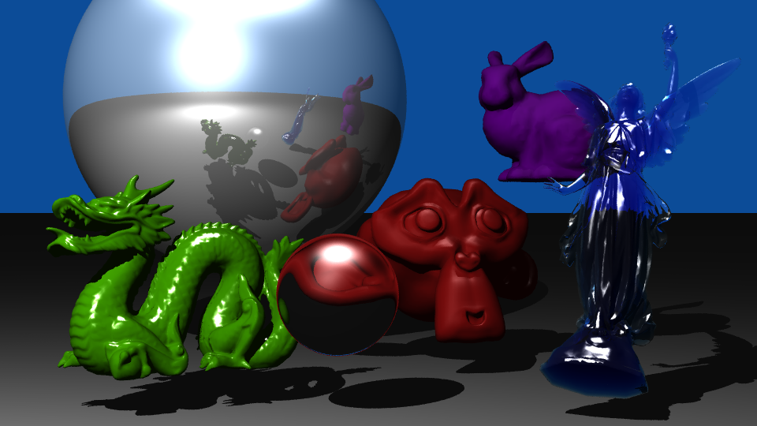

# ShinyThings Ray Tracing Renderer

## About
ShinyThings is a simple ray tracing renderer build using Python 3 and C.  The bulk of the rendering is written in C for maximum performance, but is written as a Python C Extension to access some of Python's higher-level facilities for ease of use.  Once ShinyThings is installed, a Python script which procedurally builds a scene may be run, which in turn invokes the rendering engine.  When rendering is complete, the engine returns an image which can be saved or displayed all within Python using Pillow `Image` objects.

The image above was rendered with ShinyThings to showcase as many features as possible.  It displays simple Phong reflection models (see Stanford bunny), as well as more complex features such as colored translucency and refraction (see Lucy, tinted glass angel statue).  It was rendered at a 960x540 resolution using the provided `run.py` example script on a 3.7 GHz Intel i3-4170 processor in 3 minutes and 14 seconds.  [π](https://en.wikipedia.org/wiki/Pi)

## Features
- spheres & planes
- complex triangle models
- Phong reflection model
  - ambient, diffuse, and specular lighting
- multiple point light sources with inverse square falloff
- hard shadows
- background color setting
- camera positioning and arbitrary resolution rendering
- Phong interpolation of normals
- Wavefront .obj file loading
- k-d tree spatial partitioning to optimize complex triangle model intersection
- transparency and Beer's law translucency
- reflection and refraction
- complex triangle model transforms
  - translate, scale, and rotate
- Monte Carlo pixel sampling

## Installation and Running
1. clone the repository, and `cd` into the project root directory
2. install a Python virtual environment (optional)
3. install all requirements with `pip install -r requirements.txt` (you may need to install some other dependencies)
  - NumPy and Pillow (Python Imaging Library drop-in replacement) are required
4. install ShinyThings with `pip install .`
5. create a new scene script, or execute the example script with `python3 run.py`
  - the render may take some time to complete (the example may take upwards of 3 minutes)

## API
Currently, there is no set-in-stone API to use, and most scene data is painstakingly passed to the renderer in a specific order.  The example scene in `run.py` contains some documentation of features, but is not guaranteed to be user-friendly yet.  Eventually, a real API will be built and documented.  Additionally, some features (such as Monte Carlo sampling) are currently hard-coded, and will be made available for modification in the future.

## Planned Features
- clean, documented API
- UV texture mapping
- Catmull-Clark subdivision surfaces
- multithreaded / distributed rendering
- area light sources with soft shadows
- depth of field
- motion blur
- photon mapping (to support things like caustics)
